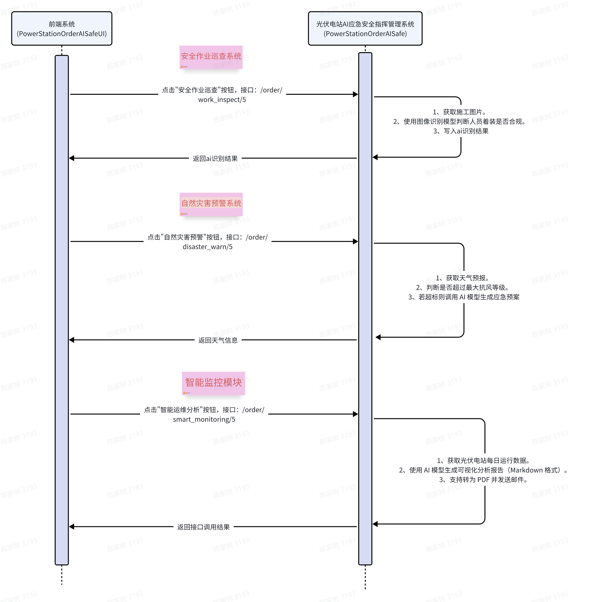

#  光伏电站AI应急安全指挥管理系统

## 目录
- [光伏电站AI应急安全指挥管理系统](#光伏电站ai应急安全指挥管理系统)
  - [目录](#目录)
    - [背景](#背景)
    - [需求目标](#需求目标)
    - [AI实现的功能切入点](#ai实现的功能切入点)
    - [系统交互设计](#系统交互设计)
    - [后端项目模块说明](#后端项目模块说明)
    - [数据库表设计](#数据库表设计)
    - [技术栈](#技术栈)
    - [展望](#展望)
    - [遇到的问题和解决方案](#遇到的问题和解决方案)
    - [工作规划](#工作规划)
  

### 背景
  * 应用场景：光伏电站建设运营期间的应急安全智能管理。
  * 应用原因：
    * 施工、运营管理人员对应急安全知识的认知参差不齐，可能未按照施工手册操作
    * 电站数量众多，需要定期安排检修和保养
    * 自然灾害变化、人为非法改造可能引起电站安全问题
    * 未经专业培训的人无法快速预警和响应光伏电站安全问题

### 需求目标
  * 提高光伏电站的安全性和可靠性，确保在紧急情况下能够快速响应和恢复运营

### AI实现的功能切入点
  * 安全作业巡查系统：
    * 接入高清监控摄像头，覆盖光伏电站的各个关键区域
    * 利用AI图片分析技术，自动识别是否存在非安全作业行为（定时任务不间断巡查）
    * 并邮件（短信）告知监工和负责人员
    * 样例数据：订单1和2
  * 自然灾害预警系统:
    * 结合电站位置，实时监控未来一天天气变化，如强风、暴雨、雷电等极端天气
    * 应用ai预警并分析得出自然灾害等级，并提供应急方案,预测未来发生的灾难情况，输出可能出现的灾情视频
    * 样例数据：订单3和4
  * 智能运维分析系统
    * 使用智能监控系统实时监控光伏电站的运行参数，如电压、电流、温度等
    * 使用AI分析历史数据，识别异常模式，提前预警潜在故障和应急方案
    * 样例数据：订单5和6


### 系统交互设计
<p align="center">
  
</p>

### 后端项目模块说明
```
      +-------------------+
      |     API 路由      |  ←—→ `api_routes.py` 是整个系统的入口，负责将 HTTP 请求路由到对应的功能模块。
      +-------------------+
                |
          +----v----+
          | 配置模块  |  ←—→ `config.py` 提供全局配置信息，如数据库连接、API 密钥等。
          +-----------+
                |
          +----v----+
          | 数据库连接模块 |  ←—→ `db_connection.py` 管理数据库连接，并提供 ORM 基类。
          +-----------+
                |
          +----v----+
          | 数据模型模块    |  ←—→ [models.py] 定义了数据库中的表结构（电站信息、操作日志、监控数据）。
          +-----------+
                /     |      \
              /      |       \
+------------+ +---------------+ +------------------+
| 灾情预警模块         | |     工作巡查模块    | | 智能监控模块     |
| ai_disaster_warn.py | | ai_work_inspect.py | | ai_smart_monitoring.py|
| 调用 AI 和工具模块    | | 调用 AI 模型       | | 调用工具模块|
                                    

+-------------+
| AI 工具模块 |  ←—→ [aiUtil.py]封装了多个 AI 模型的调用接口，包括文本生成、图像识别、视频合成等。
+-------------+
     /     \
    /       \
+--------------+ +--------------+
| 邮件工具模块 | | 文件工具模块 |  ←—→ [emailUtil.py] 和 [fileUtil.py]分别提供邮件发送和文件处理功能。
+--------------+ +--------------+

```

### 数据库表设计
```sql
-- 电站信息表
CREATE TABLE `power_station_info` (
  `id` int NOT NULL AUTO_INCREMENT COMMENT '主键',
  `order_no` varchar(255) CHARACTER SET utf8mb4 COLLATE utf8mb4_bin DEFAULT NULL COMMENT '订单号',
  `pv_pic` varchar(1023) COLLATE utf8mb4_bin DEFAULT NULL COMMENT '电站照片',
  `construction_work_pic` varchar(1023) CHARACTER SET utf8mb4 COLLATE utf8mb4_bin DEFAULT NULL COMMENT '施工作业现场图',
  `installation_address` varchar(255) CHARACTER SET utf8mb4 COLLATE utf8mb4_bin DEFAULT NULL COMMENT '安装详细地址',
  `installation_province` varchar(255) CHARACTER SET utf8mb4 COLLATE utf8mb4_bin DEFAULT NULL COMMENT '省',
  `installation_province_city` varchar(255) CHARACTER SET utf8mb4 COLLATE utf8mb4_bin DEFAULT NULL COMMENT '市',
  `installation_county` varchar(255) CHARACTER SET utf8mb4 COLLATE utf8mb4_bin DEFAULT NULL COMMENT '县',
  `installation_province_code` varchar(255) COLLATE utf8mb4_bin DEFAULT NULL COMMENT '省code',
  `installation_province_city_code` varchar(255) CHARACTER SET utf8mb4 COLLATE utf8mb4_bin DEFAULT NULL COMMENT '市code',
  `installation_county_code` varchar(255) COLLATE utf8mb4_bin DEFAULT NULL COMMENT '县code',
  `max_support_wind_power` decimal(10,1) DEFAULT NULL COMMENT '最大支持的风力等级',
  PRIMARY KEY (`id`)
) ENGINE=InnoDB AUTO_INCREMENT=7 DEFAULT CHARSET=utf8mb4 COLLATE=utf8mb4_bin COMMENT='电站信息表';

-- 操作日志表
CREATE TABLE `order_operation_log` (
  `id` int NOT NULL AUTO_INCREMENT COMMENT '主键',
  `order_no` varchar(50) COLLATE utf8mb4_bin NOT NULL,
  `operation_name` varchar(100) COLLATE utf8mb4_bin NOT NULL,
  `operation_result` varchar(50) COLLATE utf8mb4_bin NOT NULL,
  `operation_description` text COLLATE utf8mb4_bin,
  `ai_remark` text COLLATE utf8mb4_bin,
  `operation_time` timestamp NULL DEFAULT CURRENT_TIMESTAMP,
  PRIMARY KEY (`id`)
) ENGINE=InnoDB AUTO_INCREMENT=56 DEFAULT CHARSET=utf8mb4 COLLATE=utf8mb4_bin COMMENT='操作日志表';

-- 监控数据表
CREATE TABLE `pv_station_daily_monitor` (
  `id` int NOT NULL AUTO_INCREMENT,
  `order_no` varchar(50) CHARACTER SET utf8mb4 COLLATE utf8mb4_0900_ai_ci NOT NULL COMMENT '订单编号',
  `record_time` datetime NOT NULL COMMENT '记录时间',
  `voltage` decimal(10,2) DEFAULT NULL COMMENT '电压 (V)',
  `current` decimal(10,2) DEFAULT NULL COMMENT '电流 (A)',
  `max_module_temp` decimal(5,2) DEFAULT NULL COMMENT '最大组件温度 (℃)',
  `avg_module_temp` decimal(5,2) DEFAULT NULL COMMENT '平均组件温度 (℃)',
  `avg_ambient_temp` decimal(5,2) DEFAULT NULL COMMENT '平均环境温度 (℃)',
  `power_ratio` decimal(5,2) DEFAULT NULL COMMENT '功率比 (%)1.1~1.3（超配比）',
  `work_hour_count` decimal(6,2) DEFAULT NULL COMMENT '等效利用小时数 (h)',
  `power_generation` decimal(10,2) DEFAULT NULL COMMENT '实际发电量 (kWh)',
  `theoretical_power` decimal(10,2) DEFAULT NULL COMMENT '理论发电量 (kWh)',
  `system_efficiency` decimal(5,2) GENERATED ALWAYS AS (round(((`power_generation` / `theoretical_power`) * 100),2)) STORED COMMENT '系统效率 (%)75%~85%',
  PRIMARY KEY (`id`)
) ENGINE=InnoDB AUTO_INCREMENT=28 DEFAULT CHARSET=utf8mb4 COLLATE=utf8mb4_0900_ai_ci COMMENT='光伏电站日常数据监测表';
```

### 技术栈
* 后端语言：python
* 前端语言：vue
* 数据库：mysql
* 接口调试：postman
* llm：阿里的千锤百炼
* 天气预报：高德天气
* 存储服务：阿里oss
* 编程工具：vscode、pycharm、阿里通义灵码、cline


### 展望
* 接入dify实现ai应用敏捷开发
* 持续优化AI模型，提高预警准确率和响应速度。
* 扩展系统功能，增加更多安全监控和应急处理模块。
* 安全作业巡查系统目前不支持视频识别
* 未接入更加实时的通知方式，如电话、短信等
* 动态调整prompt
* 接入知识库,如应急安全生产手册
* 未输出该系统在应急管理上的成效指标等
  
### 遇到的问题和解决方案
* 在比较准确的输入首张图片和提示语后，生成的灾后视频内容不匹配。（prompt：当前光伏电站可承载的最大风力为{order.max_support_wind_power}，未来一天最大风力{max_wind_power}，为光伏电站梳理出一份完备的应急指挥方案）---解决方案：尝试寻找更加智能的ai模型/尝试使用更复杂的prompt/尝试对生成视频进行微调
* 对vue3前端技术长时间未使用，需要重新学习----解决方案：通过ai工具快速生成前端代码

### 工作规划
* 第一周：
  * 基础环境和工具准备
  * 技术设计并输出文档
  * 构建基础服务
* 第二周：
  * 后端实现三种AI应急系统功能
  * 准备业务数据（正反例数据）
  * 设计提示词
* 第三周：
  * 设计前端交互界面
  * 实现前端界面
* 第四周：
  * 自测功能
  * 调整优化
  * 功能升级
  * 输出系统操作说明
